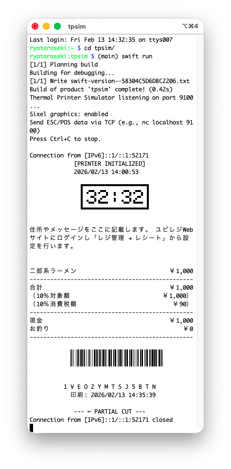

# tpsim

ESC/POS プロトコルで通信するサーマルプリンタのシミュレータです。
TCP ポート 9100 で接続を待ち受け、受信した ESC/POS コマンドをターミナル上にレシート風にレンダリングします。



## 特徴

- ESC/POS コマンドの解析とテキストレンダリング
- Sixel グラフィックス対応ターミナルでの画像表示
- Swift NIO による非同期 TCP サーバー
- macOS / Linux 対応

## Install

```bash
brew install trickart/tap/tpsim
```

## 実行

```bash
tpsim 9100 # ポートは省略可能
```

ポート 9100 で TCP サーバーが起動します。別のターミナルから ESC/POS コマンドを送信してテストできます。

```bash
echo -e "\x1B\x40" | nc localhost 9100
```

## 開発必要環境

- Swift 6.2 以上

## ライセンス

MIT License
